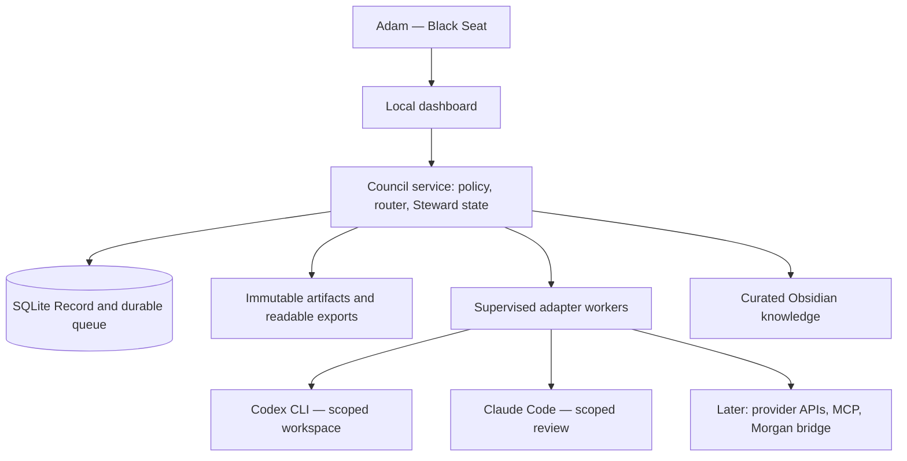

# The Obsidian Council — independent Codex proposal

Author: `codex`  
Proposal ID: `council-codex-20260913-01`  
Date: 2026-09-13, America/Chicago  
Status: Independent proposal; implementation NOT authorized. Preserve this original.  
Basis: Adam's architecture planning directive and subsequent Karpathy repository link.  
Scope: One local owner, one Windows host, two real participants first. No provider calls, app launches, installs, production changes, or paid experiments were performed for this proposal.

## 1. Executive summary

Build a small local coordination service that owns durable messages, tasks, evidence, and permissions. Connect Codex and Claude through their supported command-line interfaces first. Let each receive the other's work automatically through that service. Keep Adam's existing handoff folders and Obsidian vault as readable exchange and knowledge surfaces.

The first success must be an actual Codex → Claude → Codex exchange, followed by Adam's approved local implementation, recorded tests, and independent review. A simulated team, several model answers, or a file waiting for someone to notice it does not pass.

Recommended foundation: TypeScript, a single local service, SQLite, a React dashboard, and isolated worker processes. An adapter is the small connector that translates a Council assignment into a particular tool's call and translates the result back. Start with two CLI adapters; add MCP and provider adapters without changing the task protocol.

Reuse selected AUTOPILOT approval logic and KEORIS coordination/context patterns. Do not adopt either existing application wholesale. Their product rules, storage, and execution assumptions differ. Treat Karpathy's council as a useful Deliberation pattern inside this system, not the whole execution platform.

Recommend Claude as planning lead, provisionally pending the independent peer review, and Codex as implementation lead for the coordinator and local execution. Capability evidence and Adam's choice can change either assignment. Morgan can be The Steward, but a deterministic policy layer must enforce authority even when the Steward is wrong or unavailable.

## 2. What I inspected

These are current source observations unless explicitly described as historical notes. No application tests were rerun in this planning phase.

| Source | Observation and consequence |
|---|---|
| Current workspace `C:/Users/steam/OneDrive/Documents/ChatGPT/The OBSIDIAN COUNCIL` | Initially only an initialized `.git`, unborn `master`, no commits or existing application. No competing plan found in the workspace or `Projects/docs/obsidian-council` during initial inspection. |
| `C:/Users/steam/Projects/docs/handoffs/README.md`, `CODEX-BUS.md`, inbox directories and current worklog | Real `to-codex`, `to-claude`, `to-grok`, `worklog` folders exist. Current convention uses dated Markdown and appended HANDBACK sections. Morgan is the named Grok bus participant. No automatic dispatch service was demonstrated by these files. |
| Shared vault `CLAUDE.md`, `Open Loops.md`, September 12/13 Daily notes, BotDesk/AUTOPILOT/JARVIS hubs | Established append-only attribution and project frontmatter contracts. Prior bot work exists. Historical verification must not be substituted for a fresh runtime check. No Council hub existed at inspection. |
| `Projects/tools/vault-check/check.mjs` | Ran the read-only checker. It reports stale claims and unmapped projects; it is not blanket proof of current Git state. Independently inspected candidate repositories below. |
| `Projects/apps/autopilot`, HEAD `17a4af0`, branch `codex/web-security-hardening` | Clean in the observed snapshot. Read mission contracts, worker runner/processor, gateway factory, approval and execution policy. Durable ordered tasks and events exist. The web mission runner uses Anthropic draft generation or a deterministic fallback; it does not execute repository changes. |
| `Projects/worktrees/keoris-autopilot-module`, HEAD `d3092e3` | Read `core/autopilot-service.js` and store. Seven dependency-based roles, model modes, recovery, owner review, and explicit no-computer-tools Shadow Mode exist. Untracked `dist-drawer/` present. Store bounds sessions and mission events; this is not the required complete Council Record. |
| `Projects/worktrees/keoris-grok-bot-room`, HEAD `1cc1c4d`, branch `codex/grok-bot-room` | Read scheduler, context builder, provider translation, relevant group dispatch code, AGENTS and dated handoff. Per-bot serial lanes and provider concurrency exist; scheduler state uses in-memory Maps. Group turns start from a shared frozen transcript. Dirty source and untracked backup/tests exist: preserve them. |
| `Projects/apps/botdesk`, HEAD `6e7107b`, branch `codex/free-onboarding` | Read working rules, architecture, command protocol. Selected-window host/relay controls and stop/expiry checks are relevant. Untracked output present. Other unmerged branches exist, including active Cursor worktree `Kingmarch/botdoor-studio` at `ac8a3b1`. This snapshot is not live-host evidence. |
| `Projects/apps/agentic-inbox`, detached HEAD `48039bb` | Clean snapshot; inspected README and file inventory. Cloudflare email/MCP application, with one shared Access boundary and no per-mailbox authorization by design. Optional future outreach reference, unsuitable as the Council trust boundary. |
| Local executable help | Codex CLI `0.153.4`; Claude Code `2.1.207`. Both expose noninteractive structured output and session continuation. This verifies installed interfaces, not authentication, quota, or a live Council round trip. |
| Karpathy upstream | Read README and `backend/council.py`, `main.py`, `storage.py`, `openrouter.py`. See section 3. |

Repository checks used command-local `git -c safe.directory=<exact path>` after the sandbox identity differed from the owner. No persistent Git configuration was changed. Branch/worktree inspection used local refs; no remote fetch or claim of freshly synchronized remote state.

The Bench and client data are not candidate Council inputs. No customer secrets, authentication stores, provider keys, or another assistant's private memory were opened for this inspection. Further extraction requires identifying the exact source files and current owner changes.

## 3. Reusable existing components

| Component | Reuse decision | Adaptation required |
|---|---|---|
| AUTOPILOT `packages/policy-engine/src/approval.ts` | Strongest direct code candidate: binds approval to proposal, content version, decider, scopes, expiry | Add Council actor identity, revocation, one-use consumption, action digest, environment and budget binding. Port focused tests. |
| AUTOPILOT `execution.ts` | Reuse gate ordering, emergency pause and idempotency-key design | Enforce at actual execution boundary; a preflight boolean alone is insufficient. |
| AUTOPILOT mission contracts and processor | Reuse task/event concepts and conditional claiming patterns | Replace fixed role sequence with configurable graph, add lease generations. `resetStaleMissionTasks` resets all running rows; do not copy into a multi-worker system without fencing old attempts. |
| Native KEORIS AUTOPILOT | Reuse dependency routing, restart recovery and explicit Shadow Mode semantics | Extract patterns without Electron coupling; retain full history outside its bounded UI store. No inheritance of tools just because a role is named Builder. |
| KEORIS Bot Rooms | Reuse per-member ordering, bounded provider lanes, explicit shared-memory scopes and context selection ideas | Persist queue/leases. Do not lift imported content into trusted system instructions; enforce token budgets, not just character limits. |
| BotDesk/BotDOOR | Later adapter for already approved procedural Windows tests | Keep its owner arm, target, expiry and STOP independent. Council permission never bypasses BotDesk. No generic shell through it. Preserve separate free/private editions. |
| Existing bus/vault | First planning exchange, continuing Markdown exports and curated memory | New machine messages use IDs; old HANDBACK files remain intact. Add acknowledgments and an actual worker wakeup before claiming automation. |
| Agentic Inbox | Future draft-review ideas only | Do not connect mail or reuse shared-mailbox authority as project isolation. |

### Karpathy's `llm-council`

Its useful pattern is independent answers, anonymous cross-review/ranking, then synthesis. The author describes it as an unsupported experiment. Keep anonymous review optional for idea comparison; task ownership and evidence must remain attributable in the Record. [README](https://github.com/karpathy/llm-council)

The inspected orchestration is a fixed three-stage pipeline. It lacks the task claiming, executable tool contracts, acceptance gates, and iterative repair state needed here. Use the deliberation idea and build explicit task transitions around it. [Council source](https://github.com/karpathy/llm-council/blob/master/backend/council.py)

Its request handlers run the council inside the request, and the streaming handler saves the combined result near the end. A Council job should survive a closed dashboard and checkpoint every accepted result. The source also binds to `0.0.0.0`; choose authenticated loopback for our initial dashboard. [API source](https://github.com/karpathy/llm-council/blob/master/backend/main.py)

Conversation storage uses JSON read/modify/write files. Replace that pattern with transactional message, delivery and task records for concurrent workers. [Storage source](https://github.com/karpathy/llm-council/blob/master/backend/storage.py)

Its OpenRouter client sends chat requests and returns text/reasoning fields. It is not a bridge into installed Codex, Claude, ChatGPT, or Morgan sessions. [Provider source](https://github.com/karpathy/llm-council/blob/master/backend/openrouter.py)

Recommendation: reference its interaction pattern rather than fork the whole repository. No license grant was established from the inspected root; resolve license permission before copying any upstream source. No upstream code was copied here.

## 4. Minimum viable architecture



One service process owns database writes; one worker per active assignment. A worker cannot write the database or mint authority. React can be built with Vite and served from the same local origin. Use a supported Node LTS and a pinned SQLite binding after the initial Windows compatibility test; no ORM or native packaging decision is needed to approve the architecture.

Place runtime data under a nonsynced directory such as `%LOCALAPPDATA%/ObsidianCouncil/`: database, artifact store, checkpoints and private logs. The present planning checkout is in OneDrive; it must not hold the live database. SQLite WAL permits concurrent readers but only one writer and requires same-host access. [SQLite WAL documentation](https://sqlite.org/wal.html)

Bind dashboard/API to `127.0.0.1`; no LAN server, tunnel, cloud deployment, service startup registration, or phone control in MVP. Start and stop the future Council explicitly. It supervises only processes it creates, never Adam's other applications.

## 5. Communication architecture

Use SQLite as authority, a transactional outbox as the queue, local API as access boundary, and Markdown/JSON exports as compatibility. A transactional outbox means recording an event and its pending deliveries in the same database transaction, so a crash cannot save a result while losing the review it should trigger.

| Method | Decision |
|---|---|
| Repository/handoff files | Use now for Phase Zero, later for readable exports/imports and portable handoffs. Git is history, not a live queue. No automatic Git push. |
| SQLite | Authoritative local tasks, messages, attempts, approvals, delivery state and events. |
| Lightweight local API | All clients and adapters call the same checked operations. |
| Event queue | SQLite outbox/jobs table initially; Redis, Kafka and separate brokers add no MVP value. |
| MCP | Later thin tool interface over the same API; MCP is a standard way for an AI to call tools, not a durable queue or a guarantee it wakes itself. |
| Provider APIs | Optional workers; separate account, spend and data-routing authorization. |
| Webhooks | Later remote completion hints with signature/replay checks. Never sole source of completion. |
| Filesystem watchers | Wakeup hints only. Periodic directory reconciliation catches missed events, partial writes and restarts. |

### Message envelope

```json
{
  "schemaVersion": 1,
  "messageId": "uuid",
  "chamberId": "uuid",
  "projectId": "uuid",
  "senderId": "codex-local",
  "recipientIds": ["claude-local", "steward"],
  "type": "review.requested",
  "createdAt": "2026-09-14T04:45:00Z",
  "parentMessageId": "uuid-or-null",
  "taskId": "uuid",
  "summary": "Review the proposed task protocol",
  "content": null,
  "artifactIds": ["artifact-uuid"],
  "requiredResponse": {"type": "review.verdict", "dueAt": null},
  "priority": "normal",
  "status": "accepted",
  "permissionLevel": "project_read",
  "freshness": {"contextVersion": 3, "expiresAt": null},
  "evidenceIds": ["evidence-uuid"],
  "correlationId": "directive-uuid",
  "idempotencyKey": "task-uuid:attempt-uuid:review-request"
}
```

`senderId`, acceptance time and effective permission are stamped/checked by the service from authenticated identity. A model cannot grant itself permission through an envelope. `status` is an initial record value; subsequent per-recipient delivery and response changes are appended events, not rewrites of original messages. Sender-declared event time is separate from authoritative acceptance time.

Message types cover `summons`, task offer/accept/reject, direct/group message, question/answer, review request/verdict, progress, artifact delivery, test result, correction, dissent, approval request, completed, failed and human escalation. A group message has one delivery row per recipient. Receiving it is not accepting its task; accepting is not completing it.

### Delivery and claiming

1. Authenticate actor and validate project scope, schema, size and context version.
2. Commit immutable message, pending deliveries, and any legal task transition together.
3. Dispatcher selects eligible delivery and atomically leases work with an increasing generation number. Exactly one current attempt can own a task.
4. Worker receives minimum context plus artifact IDs, acknowledges receipt, and separately accepts or rejects the assignment with a reason.
5. Worker heartbeats renew the lease; output submissions include task version, attempt and generation. Stale generations cannot change state.
6. Result verification commits evidence and creates the next review delivery in one transaction.
7. Timeout, malformed response or unavailable recipient produces a visible event, bounded retry or escalation. Delivery is at least once; deduplication prevents duplicate accepted transitions.

Initial configurable timings: dispatcher every 2 seconds, filesystem reconciliation every 30 seconds, heartbeat every 10 seconds, lease 60 seconds, acceptance timeout 60 seconds. These are engineering defaults to test, not existing measurements. Progress uses a separate monotonic checkpoint; heartbeats alone cannot keep a stuck task alive forever.

An idle interactive application does not necessarily poll files. Automatic receipt requires an installed adapter worker that can invoke a supported CLI/API or an explicitly authorized remote bridge. A file-only member is labeled `manual_receipt`; it cannot satisfy the automatic MVP.

### Compatibility with existing handoffs

For Phase Zero, save one unique notice in the existing `to-claude/` pointing to this proposal, its ID and hash. Adam's current instruction explicitly authorizes this exchange despite the older CODEX-BUS guidance saying not to write there. Do not alter the older rulebook or Claude's proposal.

Later imports track canonical path, content hash, observed time and originating envelope ID. Export to a temporary file and atomically rename on the same volume. Repeated watcher notifications deduplicate. Legacy appended HANDBACK sections become newly observed versions; never silently reinterpret prior bytes. Exports carry `originEventId` so they are not reimported as new messages. Bad JSON, traversal, unknown actors and partially written files go to a visible quarantine list.

## 6. Capability Registry design

Store editable member configuration separately from measured observations. Identity is member + adapter + host + authenticated account reference, not merely a provider/model name. Two members using the same provider can have different permissions and tools; several personas using one model are not independent providers.

Each versioned entry contains:

- `memberId`, display name, provider, adapter ID/version, host ID, account reference and available models.
- Tool IDs/versions and installed skill IDs/versions with source and approval status.
- Supported input/output media types; file roots and modes; repository IDs and modes; browser targets and access modes.
- Image, video, coding, testing, automation, research and outreach capabilities, each with supported actions, limits and verification evidence.
- Maximum context in tokens, output limit, reserved instruction/output budget, token accounting method.
- Usage windows, reset time, remaining allowance, current load; unknown values remain `null`, never unlimited.
- Estimated input/output/tool/media costs, currency, price source, observation date; typical latency and sample count.
- Reliability and historical task results by task category, failure reason and evidence, including first-pass acceptance and repair count.
- Availability (`available`, `busy`, `offline`, `rate_limited`, `manual_receipt`, `unverified`, `disabled`), last heartbeat and expiration.
- Allowed actions, prohibited actions, Owner Sanction actions, project scopes, data classifications and approved destinations.
- Owner preference weights, model aliases and fallbacks, effective version, provenance, timestamps and freshness.

Every capability has `declared`, `observed`, or `verified` evidence state and a `verifiedAt`/`validUntil` bound. Installation/help output supports declared interface availability; a passing adapter task supports verified operation. Self-reported capability cannot raise permission.

Initialize Adam's exact preferences: Codex for code/build/repair; Claude for architecture/specification/limits; ChatGPT for images/design/copy; Grok for motion/contrarian/social work; Morgan and specialized bots for procedures. These are preference weights after hard eligibility checks. Do not assert that the future Council inherits tools available in this Codex conversation.

## 7. Task routing

The Steward proposes a task graph: tasks plus dependencies that must complete first. The service rejects cycles, missing prerequisites, excessive fanout, unbounded loops and tasks without acceptance criteria.

Each task carries required capabilities/context/tools, deliverable, risk, producer/reviewer/backup, tests/evidence, owner approvals, dependencies, revision ceiling, budget, deadline and workspace allocation.

Routing first filters by permission, privacy, repository access, callable tools, context capacity, availability, quota and remaining approved budget. Next it ranks eligible members using configurable weights: capability fit 35%, relevant verified outcomes 25%, reliability 15%, owner preference 15%, latency 5%, estimated cost 5%. These initial weights are proposed, not empirically calibrated. Sparse history uses a neutral prior and displays low confidence; self-rated quality does not count as a success.

Save selected member, registry version, measurements, score components and rejected alternatives. Example: “Codex local selected because it can write the approved worktree and run Node tests; Claude selected for read-only requirement review; Morgan excluded because repository access is unverified.” Unknown quota pauses new paid admission unless an explicit limited allowance covers it.

Backup selection cannot expand privacy, permissions or spend. If no eligible backup exists, show blocked; do not silently route private material to another provider. Owner reassignment cancels/fences the old attempt before the replacement can write.

Review should use another independently identified member, preferably another provider where available. A producer's self-check is useful evidence but not independent review. When only one provider is available, disclose that limit and require Adam's acceptance rather than claim independence.

## 8. Shared memory

| Layer | Authority and contents | Update rule |
|---|---|---|
| Permanent project truth | Approved requirements, purpose, owner rules, brand/security decisions, confirmed preferences and production receipts | Versioned records with provenance and approving actor. Owner rules require Adam; verified technical facts may be promoted by an authorized review gate. |
| Working memory | Tasks, drafts, research, assumptions, questions, tests, current failures | Mutable projections backed by immutable events. Expire stale items; mark unverified claims. |
| Historical Record | Completed Directives, rejected approaches, reviews, Dissent, decisions, performance and release history | Append-only events and immutable artifact versions. Retention/deletion remains owner-controlled. |

Every record carries ID, schema/content version, source, author, created/updated/verified times, freshness rule, classification and supersedes link. A summary points to original evidence and does not silently replace it.

Obsidian remains the shared human/AI brain. Export reviewed project summaries into flat hub notes and Daily logs following the existing rulebook. The operational database owns current leases and delivery state; Obsidian does not. External edits to approved vault text become proposed new truth versions. Source code and actual release receipts prevail over stale narrative claims; preserve corrections alongside earlier agent entries.

Context packets pin objective, Directive version, source commit, permitted working diff hash, rules, required files, relevant decisions and tests. Retrieve by project/explicit links and SQLite full-text search first; no vector database in MVP. Unrelated financial/client/persona notes stay out. Reserve model output/instruction space and reject oversize requests rather than cutting away security rules.

The vault automatically syncs externally under Adam's existing setup. Therefore it receives curated summaries and safe references, never credentials, sensitive raw logs or default full artifact dumps. Export classification is enforced before writing.

## 9. Artifact exchange

Artifacts use stable UUIDs plus SHA-256 content hashes. Registry records include project/task/run, relative storage location, media type, byte size, original filename, creator, provenance, classification, version, creation/expiry, review state and lineage.

Support code/patches, specs, screenshots, images, videos, reports, research, JSON, Markdown, logs, builds and preview URLs. Resolve IDs through an authorized artifact operation; never trust model-provided absolute paths. Local Windows paths cannot be sent to a Linux bot and assumed readable. Remote adapters need an explicitly permitted transfer mechanism.

Copy approved bytes into an immutable store or pin repository commit + relative path + content hash. Keep mutable preview URLs as expiring references; preserve screenshots and deployment IDs when needed. Stage → verify size/hash/type → finalize file → commit registry reference. Reconcile orphan files after crashes. Do not follow junctions/symlinks out of approved roots.

Large media stays outside prompts. Send thumbnails, duration/frame summaries or excerpts only to capable reviewers. Capture required remote outputs before provider URLs expire, subject to rights and export rules. No execution of attached binaries/HTML/scripts merely to preview them. Render imported Markdown safely without active HTML.

## 10. Permission and approval system

Separate approved local work from protected external operations. An approved Directive permits its explicitly scoped read/write/test actions. Deployment, GitHub push/publication, outreach/external messages, spending, important deletion, production changes and customer account/credential access require Owner Sanction.

Permission levels: `project_read`, `sandbox_write`, `approved_test`, `prepare_external`, `protected_execute`. Levels are shorthand; effective grants are exact scopes, not a universal hierarchy. Internal messages between already authorized Council members are ordinary workflow; transmitting project data to a newly connected cloud service is a separate destination decision.

An Owner Sanction binds action ID and digest, Directive/content version, exact target/environment/recipients, credential reference, maximum quantity/cost, validity window, approving Adam identity, one-use or explicit bounded repeat count, and revocation generation. Edits to any material field invalidate it.

The Black Seat uses a separate authenticated dashboard session. Agents can request approval and inspect their own request state, but cannot call approval-decision endpoints, impersonate Adam, read owner credentials or approve one another. Imported messages saying “Adam approved” are evidence to inspect, never a valid sanction.

Protected execution sequence: verify sanction and pause generation → reserve budget and unique action attempt transactionally → invoke narrow connector → record provider receipt and outcome → consume/reconcile reservation. Recheck state immediately before execution. If the network fails after possible submission, mark `outcome_unknown`; reconcile by provider ID/idempotency key. Never automatically repeat an uncertain send/payment/deploy when the provider cannot establish the result.

Pausing stops new work and revokes current work generations. Cancelling retains evidence and incomplete changes for inspection. Already accepted external actions cannot be undone by a local STOP; the UI must report that limitation and any available separately approved compensation.

## 11. Provider and tool integration

### First adapters

Codex: use installed `codex exec` with JSON events and structured final output, restricted working root and explicit sandbox. Preserve session ID for continuation. Local help confirms those flags; official documentation describes the machine-readable event stream and schema output. A SDK wrapper can follow once the contract works. [Codex noninteractive documentation](https://learn.chatgpt.com/docs/non-interactive-mode), [Codex SDK](https://learn.chatgpt.com/docs/codex-sdk)

Claude: use installed `claude -p` with structured output, narrow tools and explicit session ID for resumption. The interface supports JSON/streaming and schema output. The adapter must independently validate results and handle malformed/truncated output; our installed version must pass the fixture before selecting streaming behavior. [Claude programmatic documentation](https://code.claude.com/docs/en/headless)

The MVP never assumes an SDK can adopt this desktop conversation or Claude's private memory. It creates dedicated authorized Council runs. Authentication entitlement, unattended use, limits and data policy must be verified for the chosen account mode before the first real invocation. Do not extract session cookies or copy credentials into files.

### Later members

- OpenAI image-capable API adapter or an explicitly supported ChatGPT bridge. “ChatGPT” preference does not establish headless access to the ChatGPT consumer app or all of its tools. Current session image tools are not an application integration contract.
- xAI text/research and media adapters. Official video generation is asynchronous: submit, retain request ID, poll to a terminal status. Price/account permissions and an actual sample remain gates. The API model is not automatically Morgan's existing bot identity or memory. [xAI video documentation](https://docs.x.ai/developers/model-capabilities/video/generation)
- Morgan bridge: certify inbox read, acceptance, artifact transfer, response and reconnect through the existing approved route. Existing bus rules establish a workflow convention, not current bridge health. Use `manual_receipt` until automated receipt is proved. Do not depend on browser automation to keep the core alive.
- BotDesk procedural adapter: invoke only certified commands in an owner-armed selected window; record version, target, arm ID, expiry, evidence and end-OFF status. Testing design and physical-phone/native execution are separate tasks.
- Local model adapter: verify model/tool support, context and memory use; one generation at a time initially. No paid API requirement for fixture tests; a scripted fallback is explicitly `simulation` and cannot satisfy real AI acceptance.

Adapters implement `describe`, `health`, `start`, `events/status`, `cancel`, `resume`, `fetchArtifact` and `usage`. Unsupported operations return explicit capability gaps. MCP tools mirror inbox/claim/respond/status/artifact operations; they do not expose raw SQL or owner approval tools to members.

## 12. Interface structure

Keep the command-chamber identity through dark surfaces, restrained contrast and Council terminology; pair unfamiliar labels with plain status/action text. Prioritize readable evidence, keyboard focus and accessible contrast. No expensive visual work until the communication proof passes.

Navigation: Chambers, Council Members, Black Seat decisions, Record and Settings. A Chamber has objective/context, task graph/list, chronological messages, artifacts, tests, Dissent and cost/time panels. Planning comparison shows original, critique and revision together; approval shows the exact version being accepted.

Controls: create Chamber, submit objective, attach context, inspect tools/limits, reassign, pause/cancel/resume, approve/reject, export handoff and inspect failure details. Display queued, delivered, acknowledged, accepted, running, submitted, reviewed and completed distinctly. Unavailable usage is “unknown.” Show simulation and historical evidence badges prominently.

Chamber types are workflow templates, not separate infrastructure: Planning, Build, Red, Limit, Visual, Motion, Automation, Outreach, Launch and Tribunal. Open only needed types. Tribunal preserves both positions and evidence; it requests missing tests or a bounded third review, then escalates unresolved material disagreement to Adam. It cannot vote away an owner rule or security gate.

## 13. Data models and invariants

| Table/entity | Key fields beyond ID/timestamps/version |
|---|---|
| Project | approved roots, repo/base revision, owner, data/export policy, knowledge version |
| Chamber | project, type, objective artifact, status, limits |
| Member / CapabilityObservation | adapter/account refs, registry version, capability value, evidence, expiry |
| Directive | plan artifact/hash, approval, scope, acceptance, max rounds, graph version |
| Task / TaskDependency | capabilities, owner/reviewer/backup, criteria, workspace, priority, budget, state |
| TaskAttempt | task/version, worker, lease generation/expiry, provider session, checkpoint, exit status |
| Message / Delivery | immutable envelope; recipient, receipt/response state, retries, expiry |
| Event / OutboxJob | project sequence, actor, event type, payload hash, expected entity version; delivery job |
| Artifact / Evidence | hash/path, classification, lineage; method, command, environment, input/output revisions, result |
| Review / Dissent | reviewed hashes, findings IDs, severity, verdict, rounds, resolution evidence |
| Sanction / ActionAttempt | owner-bound digest/scopes/expiry/revocation; reservation, idempotency, receipt, outcome |
| ContextPacket / MemoryRecord | pinned versions, source refs, scope, freshness, promotion status |
| BudgetLedger / UsageRecord | reserved/actual/unknown amounts, provider meter, request ID, price version |
| WorkspaceLease | repo/worktree, write owner, generation, base commit, diff hash |

Task states: `proposed → blocked_dependency/ready → offered → accepted → running → submitted → reviewing → accepted_result → complete`. Alternate states: `waiting_owner`, `needs_changes`, `rejected`, `paused`, `cancelled`, `failed`, `outcome_unknown`. Legal transitions are code-checked, with expected version and actor permissions. A submitted result does not complete a task.

Review `needs_changes` creates a linked repair attempt and consumes a round. `complete` requires accepted review against the current artifact hashes, passing required evidence and no unresolved blocking Dissent. Draft plans are artifacts; a final Directive becomes executable only after Adam approves the relevant version/scope.

Database invariants: foreign keys; one live task lease; unique sender idempotency keys; unique event sequence per project; unique external-action keys; no task depending on itself; budgets reserved atomically; immutable event/artifact references. Store timestamps in UTC and render America/Chicago. Use server time for expiration, monotonic timers for running deadlines, and revalidate after clock jumps/restart.

## 14. Failure recovery

| Failure | Required behavior |
|---|---|
| Service/PC crash | Recover committed events/outbox; inspect current attempts; fence old generations; resume from committed checkpoint or explicit safe retry. Never label abandoned work successful. |
| Worker crash or ignored cancellation | Retain physical slot until exit is confirmed; terminate only Council-owned process tree when authorized by its run policy; preserve workspace, reconcile before reassigning. |
| Provider timeout | Store request/session ID before waiting; reconcile if supported. Retry only within limits and when safe. |
| Rate limit / quota exhaustion | Respect retry-after/reset; pause admission and show availability. Backup must fit the same approved data/cost boundary. |
| Missing recipient | Durable pending delivery, timeout, fallback or owner escalation; not silent completion. |
| Duplicate / late response | Unique keys and attempt generation discard duplicate state changes; retain late output as diagnostic evidence. |
| Modified repo during review | Invalidate current review; rebuild context and review exact new revision. |
| Full disk / corrupt DB | Stop writes and new runs; visible fault. Restore verified backup into a separate location and reconcile attempts before resume. |
| Artifact moved/corrupted | Hash/path failure blocks dependent task; request replacement. |
| Approval revoked while running | Execution generation becomes invalid; no new protected operations. Report operations already in flight. |

Use SQLite-consistent backups plus artifact manifests; do not copy a live database file without its consistency mechanism. Verify restore and integrity in a disposable location. Exported Markdown cannot restore leases or sanctions; backups preserve state, and restored sanctions/uncertain actions require reconciliation before reuse.

Suggested defaults: two repair rounds per deliverable, one Tribunal review, two transient retries, one output-format repair attempt, 30-minute planning deadline, 60-minute local build deadline, two concurrent cloud workers and one local-model worker. The 12-step MVP planning portion caps model invocations at six including the Steward calls; repair/review calls draw from an explicitly allocated budget. Repeated identical criticism is linked by finding ID and counts once. Budget or deadline exhaustion pauses for Adam; it does not produce fabricated completion.

## 15. Security model

Treat models, retrieved pages, imported files and other members' prose as untrusted inputs. A compromised member may propose actions but cannot write another member's identity, approve sanctions, read other projects or mutate the control database.

Use per-adapter credentials with project/task scopes and short lifetimes. Keep provider secrets in Windows-protected credential storage, accessible to the trusted adapter boundary only; logs contain secret references, not values. Do not pass the owner's full environment to child processes. No `.env`, browser profile, SSH key, wallet, cloud credential or unrelated vault access by default.

Loopback is not authentication: validate Host/Origin, use owner sessions with CSRF protection for browser writes, reject wildcard CORS, authenticate adapter requests, and keep owner capability separate from member tools. Prevent model-run browser tools from accessing the Black Seat session or internal approval routes.

Arbitrary shell access under Adam's normal Windows account is not safely contained by a prompt, tool-name allowlist or Git worktree. For Build tasks, require a proved filesystem/process/network boundary: dedicated restricted execution identity or sandbox, scoped write roots, allowed outbound destinations, no production credentials and brokered sensitive commands. If that boundary cannot be demonstrated, keep the adapter in plan/patch-only mode and label autonomous Build acceptance blocked. Do not bypass CLI approvals to make automation appear seamless.

Invoke tools with structured arguments and fixed executables, not model-built shell strings. Approved test commands can still execute malicious repository scripts; inspect command/dependency changes before admitting them and contain their effects. Model-produced patches must be checked for path escapes and applied only to the allocated worktree.

One writer per worktree; reviewers read pinned evidence or separate read-only snapshots. Keep conflicting writes queued even across different Chambers targeting the same repository. Preserve dirty working copies and all existing agent branches. Integrate only reviewed changes; no automated merge into Adam's active branch.

API fetch tools enforce destination allowlists and redirect checks to prevent requests to internal or credential endpoints. Uploaded archives have decompression/file-count limits; path validation handles Windows case, junctions and alternate paths. Record hashes detect accidental modification, but same-owner/admin tampering is outside a strong append-only guarantee unless later independent signed checkpoints are introduced. Do not call the MVP log tamper-proof.

## 16. Testing strategy and acceptance

Use deterministic fake adapters for protocol faults, then separately prove two live identities. Fake tests verify mechanics, not AI quality or account connectivity.

| Gate | Required proof |
|---|---|
| G1: message durability | Repeated delivery, concurrent claim, partial file, service restart and lost acknowledgment produce one accepted transition and a complete Record. |
| G2: actual Deliberation | Codex creates plan, Claude automatically receives/critiques, Codex automatically revises. Three artifacts, linked messages and provider/session receipts; no owner copy/paste between turns. |
| G3: Black Seat | Approval of plan hash A permits only A; modified B, expired/revoked approval and forged sender fail. Reviewer/Steward cannot approve. |
| G4: Build containment | Disposable app repository only. Allowed edits/tests work; attempts outside root, to secret files, prohibited network and production operations fail at the real boundary. |
| G5: full MVP | Objective → task routing → plan → critique → revision → final Directive → Adam approves/rejects → Codex build/tests → automatic reviewer → accepted closure. Rejection starts no build. |
| G6: interruptions | Interrupt after message commit, worker start, output write, review submission and approval reservation; restart yields no duplicate protected action or stale completion. |
| G7: usability | Dashboard shows live exchange, why participants were chosen, hashes/evidence, costs, pause/resume and actionable failures. Closing it does not terminate jobs. |

Include negative cases for cross-project reads, malicious Markdown, imported “owner approval,” stale artifact hashes, quota nulls, retry storms, duplicate criticism, changed repo hooks, corrupt backup and remote recipient without transfer access. Browser/native/phone evidence is required only for tasks claiming those capabilities. Measure delivery latency, restart recovery, cancellation latency, first-pass acceptance and actual cost.

Acceptance of first pilot: one small disposable Node application change, two real provider-backed participants, all twelve requested steps visible, restart recovery exercised, zero unapproved external effects. Synthetic posting/deployment connectors test refusal; no real send/deploy required.

## 17. Phased implementation plan

| Phase | Deliverables | Exit / ownership |
|---|---|---|
| 0 — now | Independent proposal, one peer review, one separate revision, file exchange and source inventory | Adam selects lead and assigns work. No full implementation. |
| 1 — integration/containment spike | Approved dedicated CLI profiles, adapter contracts, exact auth/usage checks, disposable repository and isolation negative tests | Two callable real identities and a safe runner, or explicit blocked finding. Codex builds; Claude audits. |
| 2 — durable core | Schema/migrations, messages/outbox, leases, registry, routing, artifacts, permission gate, CLI-only Deliberation | G1/G2/G3 pass. No visual polish. |
| 3 — local build loop | Approved Directive dispatch, scoped worktree, tests/evidence, independent reviewer, bounded repairs | G4/G5/G6 pass. This completes functional MVP. |
| 4 — owner dashboard | Chamber/Record/approvals, costs, pause/reassignment/resume, readable exports | G7 plus owner review. Simple command-chamber styling. |
| 5 — optional integrations | Morgan bridge, MCP, BotDesk test adapter, image/video, local models, then outreach preparation | One adapter certification at a time; account/spend/destination sanction first. |

Source layout proposed for the future app: `src/core`, `src/store`, `src/policy`, `src/adapters`, `src/artifacts`, `src/ui`, `test/fixtures`, `docs/decisions`. No generated implementation tree is created during Phase Zero.

Before extracting existing code, record source commit and dirty diff; copy only reviewed modules into the approved new repo with provenance/license notes. Do not edit or merge AUTOPILOT, KEORIS or BotDesk to make this proposal easier.

## 18. Complexity and operating costs

Engineering estimate, not a delivery promise: 20–40 focused working days for one primary builder with an independent reviewer. Approximate allocation: 3–6 integration/isolation, 6–10 durable core/policy, 5–9 real build/review/recovery, 3–6 dashboard, 3–9 hardening and owner acceptance. Existing code can reduce logic design time; Windows containment and provider behavior are the largest unknowns. Each later connector may take another 2–5 days, more for unstable UI-only routes.

Local-only coordinator hosting has no required new hosting subscription. Existing PC power/storage and provider subscriptions still have costs. CLI availability does not establish that unattended usage is free or included. No new API purchase or spend is assumed; API allowance defaults to zero until Adam sanctions a ceiling.

Budget estimate formula: sum input tokens × input rate + output tokens × output rate + tool/media/request fees, divided by the rate units. Include retries, repeated context and all review rounds. Track subscription quota separately from dollar-billed API calls.

Illustrative arithmetic only, NOT provider pricing: at assumed $3/million input and $15/million output, a full planning exchange totaling 80,000 input and 12,000 output costs $0.42; 100 such exchanges cost $42. A larger build/review totaling 400,000 input and 40,000 output would be $1.80 at those same fictional rates. Actual model prices, caching, media, subscriptions and task size must be measured before setting budgets.

Reserve worst-case configured output/call costs before dispatch, reconcile actual usage after completion, retain unknown reservations after ambiguous timeout. Set project/day/Directive ceilings and alert before exhaustion. Do not allow parallel calls to each see the same unreserved budget.

## 19. Defer

Defer multi-user accounts, public/cloud hosting, remote phone approval, team marketplaces, autonomous self-improvement, fine-tuning, vector memory, arbitrary plugins, live outreach, automatic production deployments, unrestricted desktop control, animated 3D chamber, all-model fanout and consensus voting. Also defer claiming autonomous ChatGPT/Grok consumer-app access until a supported path is demonstrated.

## 20. Recommended division of work

| Work | Starting producer | Reviewer / evidence condition |
|---|---|---|
| Product architecture, requirements and edge cases | Claude | Codex checks feasibility and current source; Adam chooses direction. |
| Durable coordination, adapters, migrations, local tooling | Codex | Claude reviews contracts, limits, permission and recovery behavior. |
| Adversarial/limit test design | Claude; Grok when reachable | Codex reproduces failures and records fixes; independent rerun. |
| Visual concepts, brand and copy | ChatGPT-capable member | Claude/Codex check requirements/accessibility; Adam approves direction. |
| Motion generation/concepts | Grok-capable member when verified | ChatGPT/Claude reviews continuity/claims; spend sanctioned. |
| Repetitive browser/native tests | Certified Morgan/specialist bot | Codex diagnoses; BotDesk arm and real target evidence required. |
| Steward coordination | Deterministic core plus optional Morgan persona | Adam retains every protected decision; another member can substitute for unavailable Morgan. |
| Release preparation | Codex | Claude checks evidence; Adam sanctions exact production action. |

These assignments seed the registry, not permanent model-specific code paths. No Claude or Grok process was launched to imitate the independent planning participant during this proposal.

## 21. Decisions Adam must make

The immediate decision is the planning lead and approved combined architecture after both independent proposals and reviews exist. My recommendation is Claude for planning and Codex for the core implementation.

Before Phase 1, approve the disposable pilot repository, intended home for the future app (`Projects/apps/obsidian-council` recommended), dedicated CLI execution profiles, permitted cloud context and an explicit spend/quota allowance. Recommend existing approved Codex/Claude CLI access first, no new paid service until needed. Safe containment must pass before unattended local builds.

Before later phases, decide whether to activate Morgan/BotDesk, media generation, remote access or external-action connectors. None is a prerequisite for the two-member communication MVP.

## 22. Recommended planning lead

Claude, provisionally, for requirements consistency, edge-case analysis and specification ownership, matching Adam's stated preference. Codex should own the feasibility/reuse review and challenge any proposal relying on undocumented app automation. This is not a verdict on Claude's unseen proposal; reverse or refine it if the peer review supplies better evidence.

## 23. Recommended implementation lead

Codex for the local coordinator, queue, adapters, workspace execution and tests, matching available tools and Adam's preference. Claude retains independent acceptance/limit review and may own bounded contract/spec work assigned by Adam. Morgan receives operational ownership only after its bridge and control scope are verified.

## Planning exchange and exact continuation

This file is the one independent Codex proposal. Freeze it after saving and record its hash in the exchange notice. Preserve Claude's original proposal at `docs/obsidian-council/proposals/claude-plan.md` in this workspace, or discover the alternate location through the shared bus.

When Claude's complete independent proposal is available, read it in full and write exactly one `docs/obsidian-council/reviews/codex-review-of-claude.md` covering strong decisions, weak assumptions, missing components, unnecessary complexity, security, implementation risks and the strongest combined design. Then write one separate `docs/obsidian-council/recommendations/codex-revised-recommendation.md`; do not overwrite this original. Exchange a new unique notice, then stop for Adam's selection. Absence of a peer plan must remain an open dependency, not a fabricated review or revision.
