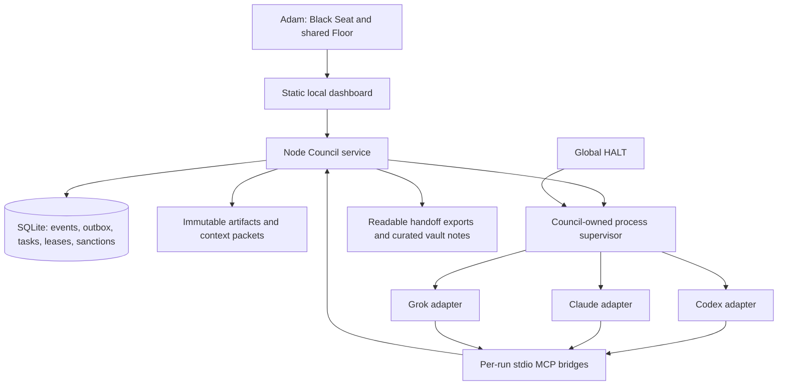

# Codex's one revised recommendation

Author: `codex`. Date: 2026-09-14, America/Chicago. Phase Zero only.

This is Codex's one revision after reading Claude's independent proposal, review and revision and writing `reviews/codex-review-of-claude.md`. Preserve both original proposals. Where this document differs from my original, this is my current recommendation. Adam has not selected implementation owners or authorized a build in this task.

## 1. Decision in plain language

Build the smallest shared room that lets Adam summon two connected AI members, talk with them, watch them ask each other questions, and turn an approved plan into tested local work. Use the existing discussion pattern from Karpathy and our existing approval/coordination ideas, with a small durable local core that survives interruptions.

I accept Claude's simpler starting stack: **plain Node, built-in SQLite, one static dashboard page**. Keep the database transaction/outbox and lease-generation rules from my original. Include **MCP in the first working loop**, as a tool interface for running members. Discover **Codex, Claude and Grok CLI** from the beginning, but require only two certified adapters for the first chat proof.

Recommend **Claude as planning/specification lead; Codex as implementation lead; Claude as independent acceptance reviewer; Grok as a certified optional adversarial reviewer**. Morgan can hold the Steward persona toward Adam after its bridge is proven; the workflow does not depend on Morgan being reachable.

## 2. What changed and why

| Original Codex position | Revised position |
|---|---|
| TypeScript/React/Vite and pinned external SQLite binding | Plain JS modules, built-in SQLite, static page for pilot; runtime validation remains required. |
| Two discovered CLI candidates | Three discovered: Grok 0.2.99 is installed. Actual auth/quota/role operation remains a gate. |
| MCP later | Per-run stdio MCP bridges from the first interactive loop. |
| Live Summons recorded as owner steering | Explicit first acceptance scenario and Floor workflow below. |
| Bench excluded from candidate inputs | Trading data still excluded; reviewed named source patterns are useful with corrections. |
| Per-Directive stop emphasis | Add global HALT and tested supervisor cancellation path. |
| Illustrative API cost arithmetic | Lead with verified account mode, quota, measured calls and unknown dollar values; API spend defaults to zero. |
| Broad multiweek estimate | Separate first exchange from full Build/recovery milestone; re-estimate after the first spike. |

I do not adopt blanket permission bypass, a fixed three-call acceptance rule, direct dual writing of JSONL/SQLite, or “installed means free and verified.” Details are in my peer review.

## 3. Concrete minimal architecture

One service owns the database. Each CLI-spawned MCP bridge is a client, never another database writer. Each bridge's authenticated run identity determines sender, scope and allowed operations. No owner sanction tool is exposed to member processes. The service serializes protected mutations and stores the message, next delivery and task transition together.

State: `%LOCALAPPDATA%/ObsidianCouncil/`, outside OneDrive and vault sync. Planning files are now together in the current Council workspace at Claude's `5a1a719` plus Codex's prior commit; preserve them. Future code home remains the proposed `C:/Users/steam/Projects/apps/obsidian-council`, pending Adam's selection. Do not move folders or create a remote during this review.

Serve the dashboard on authenticated loopback with Host/Origin and CSRF checks. An obscure/random port is not the security boundary. No cloud listener, startup task or phone service is required for the pilot.

Node 26.1.0 is locally installed and the SQLite module loads. Treat this as a pilot candidate, not a blanket release endorsement. Official docs describe `node:sqlite` as release-candidate stability and v26 as Current; select/pin a supported runtime and test backup/migrations before durable release. Never change global Node automatically. [Node SQLite](https://nodejs.org/api/sqlite.html), [Node releases](https://nodejs.org/en/about/previous-releases)

## 4. Live Summons: the first product experience

Adam creates a Chamber and types “Codex and Claude, join me.” This creates two durable addressed Summons. The dispatcher starts or explicitly resumes their dedicated Chamber sessions with scoped history and capabilities. Their acknowledgments and replies appear on the Floor. A background job is present only when the process/receipt state supports that label.

Default conversation policy:

1. Addressed members respond; spectators are not invoked for every line.
2. A member can ask another member one bounded follow-up. The waiting member checkpoints and releases its worker slot; the answer resumes it later.
3. Default automatic chain depth is two member-to-member hops and four automatic replies per owner turn. Then return the Floor to Adam, unless an approved Directive defines another bounded workflow.
4. Owner messages are ordered, and only one run uses a member/Chamber session at a time. Interruptions fence stale output; they do not lose pending owner messages.
5. Presence distinguishes invited, starting, responding, idle, offline and blocked, with a real reason. Idle means no current computation, not unlimited availability.
6. Use explicit recorded provider session IDs. **Grok resumes with `--resume <id>`; `--session-id` creates a new session.** If resumption fails, disclose a replacement session restored from the approved checkpoint. Do not promise exact attachment to these existing desktop chats.
7. A conversational “go” creates a reviewable decision request. Protected actions execute only through the authenticated Black Seat sanction bound to exact content and scope. Ordinary chat does not accidentally authorize deployment or spend.

These are proposed defaults to test, not already working behavior. Selecting a member does not authorize a new cloud destination or broader data access.

## 5. Efficiency without skipping verification

Use two members per task by default and route only to eligible verified capabilities. Additional members require a stated capability gap, material Dissent or owner request. Registry preferences do not outrank privacy, permissions, quota or budget.

Call budgets:

- Plan accepted on first review: two specialist calls.
- Material revision required: four calls — plan, review, revision, review of revised version.
- Deterministic code assembles the accepted Directive; another synthesis model is optional and metered.
- All graph-planning, context-summary, review, repair and escalation calls count. Optional Tribunal calls need remaining approved allowance. When exhausted, pause; never silently discard final review.

Context packets contain current rules, exact task, relevant excerpts and immutable artifact references under a token budget. Session reuse may reduce repeated transfers, but does not make provider context free. Cache only results whose task/context/configuration/hashes/freshness still match. Never cache a sanction as reusable authority.

Measure accepted results per minute, tokens and verified incremental dollar cost, plus first-pass acceptance and repair count. Include failed and retried calls. Subscription quotas are separate from API dollars; unknown remains unknown. Compare two-member versus broader review on the same small owner-approved fixture set, repeating enough to notice variation. Three fixtures provide directional evidence, not a statistically established universal winner. Never spend on the comparison without an allowance.

## 6. Correct authority and execution boundary

Keep the original content-bound Sanction, exact target/environment/recipients, expiry, revocation generation, budget reservation, one-use attempt and provider receipt. Models request actions; deterministic code checks them at execution. Ambiguous external outcomes remain `outcome_unknown` until reconciled.

Build runs use a certified sandbox with no unrelated roots, production credentials or unrestricted egress. Codex is the first candidate because it has Windows sandbox support; the real supervised configuration must pass negative tests. An installed component alone does not pass this gate.

Claude and Grok review roles initially receive only scoped context and Council artifact tools. Remove broad native read/write/shell/web tools and ambient integrations where their isolation cannot be guaranteed. Their returned patches remain inert artifacts. Explicitly test that inherited hooks, plugins, MCP servers and credential helpers cannot expand the run's authority. A private credential store is not sufficient if the same worker identity can ask it for the owner token.

Independent reviewers choose evidence and tests; a separately recorded contained runner executes approved tests. Do not give an uncontained reviewer shell access to “rerun read-only tests.” Tests can write files, execute dependencies and use networks. Reports bind command, environment, input revision, artifacts, exit status and output hashes; a claimed pass is not enough.

No blanket `--dangerously-skip-permissions` or `--always-approve` policy. Permit only narrowly specified noninteractive execution with a tested boundary; blocked tools return structured failures rather than stalling hidden prompts or auto-approving unknown effects.

Global HALT is a supervisor input independent of ordinary DB state. It blocks new dispatch and action admission and cancels only Council-owned process trees. Bound synchronous database work and test cancellation while the store is busy; add a separate watchdog if required. Already accepted remote actions are reported, not described as undone. Clearing HALT requires explicit resume.

## 7. Source reuse with limits

| Source | Reuse | Do not carry over |
|---|---|---|
| AUTOPILOT approval/execution | Version/scope/owner/expiry validation and focused tests | Assumption that validation alone enforces execution containment. |
| KEORIS Bot Rooms/native AUTOPILOT | Context scopes, per-member sequencing, dependency and recovery ideas | In-memory queue as durable authority, bounded UI history as full Record. |
| Bench audit | Canonical hashing and redaction ideas | Separate nontransactional tip/event writes, swallowed audit failures, skipped corrupt records. |
| Bench stdio MCP | Request/response framing ideas | Market imports, caller-defined identity, unbounded buffers, untested protocol compatibility. |
| Bench executor arm | One-target expiry principle | Existing topics, accounts or remote arm state. |
| x-poster | HALT and approval/archive workflow | Presumed exactly-once behavior across partial sends or crash. |
| Karpathy | Independent response/cross-review/synthesis pattern | Treating Q&A pipeline as a completed executable agent coordinator. |

Store hash-linked events inside SQLite transactions. JSONL and Markdown are reproducible exports tracked by cursor. No automatic Git push or claim that same-user Git storage is an independent tamper-proof witness. Export only classified safe summaries into the auto-synced vault. All other projects remain unchanged.

MCP may be a tiny reviewed implementation if it passes all required protocol/client tests. Allow a justified maintained dependency if that is safer and smaller than custom code. Avoid turning “zero dependencies” into an absolute product requirement.

Phone notifications remain a defined optional adapter, disabled initially. Later use an authorized private destination with minimal payloads; do not treat a secret-looking public topic as an authorization scheme. No BotDesk redeployment assumed; verify its existing approved environment when that later adapter is selected.

## 8. Phases and proof

| Phase | Concrete deliverable | Exit gate |
|---|---|---|
| 0 — selection | Both original proposals, both reviews, both revisions, explicit remaining differences | Adam selects plan, owners and first bounded work. This review completes Codex's planning slots. |
| 1 — adapter and safety spike | Resolve executable/version; verify approved account mode and metering; isolate configuration; test two actual dedicated member sessions and candidate Build containment in disposable data | Two callable identities with honest scopes, or explicit blocker. No scheduled startup. |
| 2 — Floor and durable collaboration | Messages/outbox, attempts, artifacts, scoped MCP, minimal owner/Floor UI, directed Summons and question/resume flow | Real two-member plan/review exchange survives restart; no copy/paste. G1/G2/G3. |
| 3 — full local Build loop | Owner-approved plan → contained code changes → test evidence → independent review → bounded fixes | Exact twelve-step MVP plus G4/G5/G6. No unreviewed material revision. |
| 4 — usability and measurement | Comparison view, registry, costs, export, pause/reassign/resume and efficiency fixtures | G7 and Adam's experience review. |
| 5 — extra capabilities | Third member if not already certified, Morgan, BotDesk, media, phone | Each separately certified within explicit scope/budget. |

Prefer Codex/Claude as the first pair if both pass equally promptly because the full workflow needs the Codex Build adapter. A Claude/Grok planning demonstration is welcome if certified earlier; label it the planning proof rather than all twelve steps. Third-provider availability must not delay the first two-member success.

Keep the earlier 20–40 focused days only as a rough engineering estimate for the broad hardened scope, not a promised date. Report actual effort and blockers after Phase 1 and re-estimate. The first exchange should be a distinct earlier checkpoint with no claim of production readiness.

## 9. Additional acceptance cases

Retain original G1–G7 and add:

- Grok restart resumes the exact saved conversation rather than creating a duplicate or selecting another Chamber.
- A requested material revision cannot close without review of its new hash.
- One-slot worker capacity can ask a peer and resume without deadlock.
- MCP plus final JSON duplicates cause only one accepted submission.
- A reviewer cannot read unrelated files, load ambient privileged MCP tools, or access the Black Seat.
- A provider configured with unsupported isolation is refused; the system does not silently continue uncontained.
- DB failure, corrupt export and truncated tail do not create a success record or permit an unaudited protected action.
- HALT remains responsive under bounded DB load and reaches Council-owned child processes; unrelated apps remain untouched.
- Missing auth/quota/cost remains blocked or unknown, never “free and available.”

Fixtures and failure injection test mechanisms; two live provider-backed sessions test actual integration. Both are needed and must be labeled separately. No such live run was performed in this planning review.

## 10. Recommendation for Adam

Lock the combined small-core plan with these corrections: plain Node/built-in SQLite/static Floor, durable outbox and task attempts, scoped MCP from the first loop, two certified members initially, review of material revisions, and proven execution/data boundaries. Keep Karpathy as useful prior art; no claim that it failed to deliver its advertised cross-review.

Choose Claude to own the specification and acceptance criteria, Codex to implement the approved local proof, and Grok to review adversarially once certified. Keep Morgan's Steward role configurable. Preserve this shared planning repository; use `Projects/apps/obsidian-council` for future application work only after the home is approved.

Remaining owner decisions: confirm this direction/ownership, authorize the first disposable adapter proof with exact account/data scope and usage ceiling, and later approve optional remote or external-action integrations. The technical corrections above should be acceptance criteria, not another round of abstract stack debate. No implementation, process launch, spend, push, deployment or protected action is authorized merely by this recommendation.
